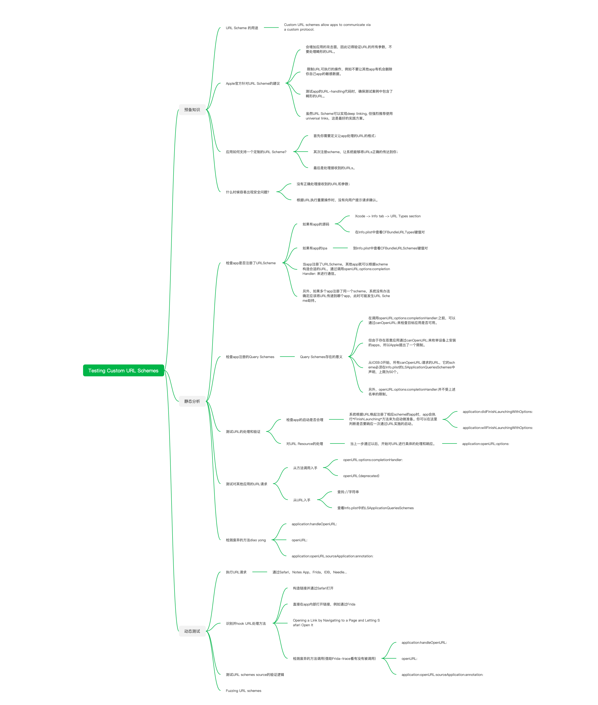

# Testing Custom URL Schemes 

阅读 [Testing Custom URL Schemes (MSTG-PLATFORM-3)](https://mobile-security.gitbook.io/mobile-security-testing-guide/ios-testing-guide/0x06h-testing-platform-interaction#testing-custom-url-schemes-mstg-platform-3) 所做的笔记，便于快速的检索和回顾。

