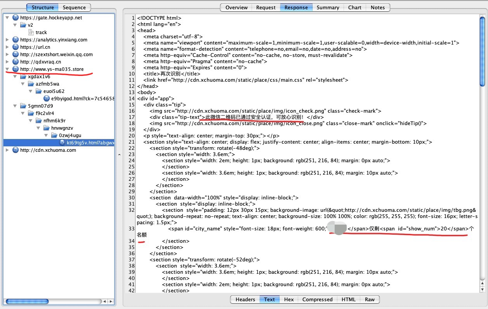
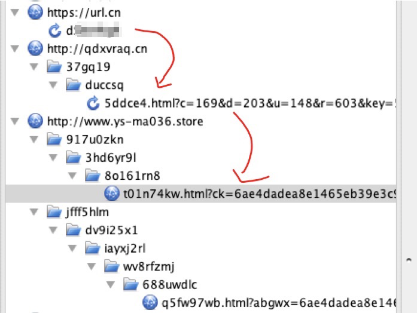

# iOS Wechat中二维码扫描

起因是一个微信好友发一张二维码给我，问这是真是假（一个活动促销）。我去找了个二维码解析网站，解析出来的网址是：https://url.cn/d*********，是一个腾讯短网址。

二维码打开后的活动界面如下。我不断点击识别二维码，剩余的名额总是诡异的递减1。


因此就想看返回的页面到底是怎么生成的，于是抓包。很好玩的是，原来“此微信二维码已通过安全认证”不是微信评估得到的。



而剩余量的秘密在：

```javascript
function getQuota() {
  var quotaName = 'quota2' + '169' + '4575';
  var quotaDefault = 20;
  var quota = localStorage.getItem(quotaName);
  if (quota == null || quota == '') {
    localStorage.setItem(quotaName, quotaDefault);
    quota = quotaDefault;
  } else {
    if (quota <= 2) {
      localStorage.setItem(quotaName, quotaDefault);
      quota = quotaDefault;
    } else {
      --quota
      localStorage.setItem(quotaName, quota);
    }
  }
  return quota;
}
$("#show_num").html(getQuota());
```

整个通信流程大致是如下所示，解析短网址得到最终的网址，返回活动界面的html。由于前后不是同一次抓包，所以网址有所不同；至于为什么不一样，同学猜测是动态生成，怕被屏蔽。




接下来的计划是动态测试，看逻辑处理上的细节，比如QR Code识别、对返回html的加载等等。