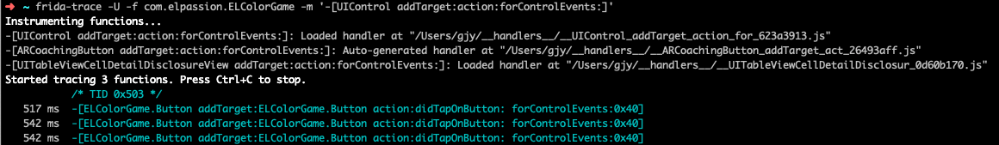
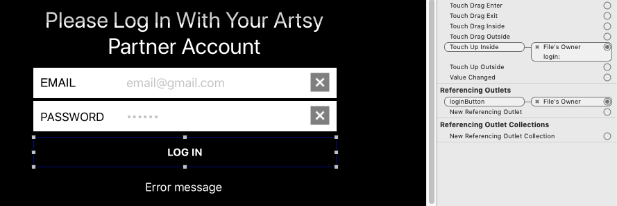
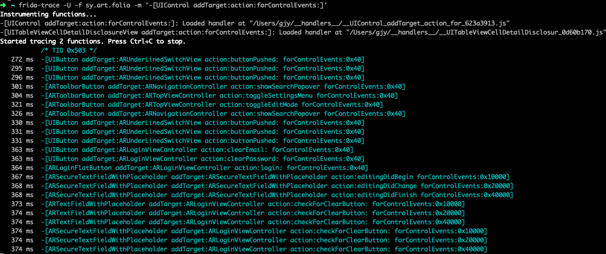

# 如何获得UIControl与action之间的关联

## 正文

### 预备知识

#### UIControl以及Target-Action机制

根据[Apple Developer Documentation](https://developer.apple.com/documentation/uikit/uicontrol?language=objc#1943645)，

> Controls implement elements such as buttons and sliders, which your app might use to facilitate navigation, gather user input, or manipulate content. Controls use the Target-Action mechanism to report user interactions to your app.
>
> ...you write action methods to respond to control-specific events...The control handles all the work of tracking incoming touch events and determining when to call your methods.
>
> ...When adding an action method to a control, you specify both the action method and an object that defines that method to the [`addTarget:action:forControlEvents:`](https://developer.apple.com/documentation/uikit/uicontrol/1618259-addtarget?language=objc) method. (You can also configure the target and action of a control in Interface Builder.)...

通过上文可以总结得到以下信息：

1. app developer为特定UIControl的特定事件编写响应代码；
2. 然后通过调用addTarget:action:forControlEvents:或在Interface Builder中配置，将上述响应代码与UIControl关联起来。

#### addTarget:action:forControlEvents:

根据[Apple Developer Documentation](https://developer.apple.com/documentation/uikit/uicontrol/1618259-addtarget?language=objc)，该方法的定义为：

> Associates a target object and action method with the control.

方法原型：

```objective-c
- (void)addTarget:(id)target 
           action:(SEL)action 
 forControlEvents:(UIControlEvents)controlEvents;
```

以一个例子进行说明：

```objective-c
[a_control addTarget:a_target action:an_action forControlEvents:an_event_type];
```

这条语句会注册一个这样的关联：当a_control发生an_event_type类型事件时，方法[a_target an_action]会被调用来处理这个事件。

### app运行时，关联control与action的时机

在对具体案例进行分析前，先给出目前得到的结论：

1. 无论开发时关联control与action的方式是通过代码还是Interface Builder，在app运行时，关联的建立都是通过addTarget:action:forControlEvents:实现的；如果开发时是通过Interface Builder，那么由系统代劳。
2. addTarget:action:forControlEvents:被调用的时机通常是UIControl所在View被加载的时候，也就是这个UIControl被初始化的时候；这也意味着如果一个UIControl所在的view没有被加载的机会，关联也就无法建立。

接下来是一些案例分析，用于分析的app都是开源项目并且在App Store中上架。

#### ELColorGame v1.0.1

##### 源码分析

这是ELColorGame中Button的实现。button初始化时，通过configureButtonAction()来为自己添加action。

```swift
//
//  Button.swift
//  ELColorGame
//
//  Created by Mateusz Szklarek on 26/09/15.
//  Copyright © 2015 EL Passion. All rights reserved.
//

import UIKit

class Button: UIButton {
    
    typealias ButtonActionClosure = () -> ()
    var buttonActionClosure: ButtonActionClosure?
    
    init(title: String, color: UIColor) {
        super.init(frame: CGRectZero)
        
        setTitle(title, forState: UIControlState.Normal)
        titleLabel?.font = UIFont(name: BebasNeueBold, size: 22)
        setTitleColor(UIColor.whiteColor(), forState: UIControlState.Normal)
        layer.cornerRadius = 25.0
        backgroundColor = color
        configureButtonAction()
    }
    
    ...
    
    private func configureButtonAction() {
        addTarget(self, action: Selector("didTapOnButton:"), forControlEvents: UIControlEvents.TouchUpInside)
    }
    
    func didTapOnButton(sender: UIButton) {
        buttonActionClosure?()
    }
    
}
```

从第30行代码可以看到，当前button发生TouchUpInside事件时，当前button的didTapOnButton:方法会被调用。而从第34行可以看到，didTapOnButton:中真正的响应代码是button的buttonActionClosure指向的function。查找buttonActionClosure属性的write usage，发现以下代码片段。

```swift
class StartView: UIView {

    private weak var delegate: StartViewDelegate?
  
  	private let newGameButton = Button(title: kNewGame.localized, color: UIColor(color: .Green6BE01A))
    private let rankingButton = Button(title: kRanking.localized, color: UIColor(color: .Turquoise54C7C7))
    private let infoButton = Button(image: UIImage(asset: .Info))

    init(delegate: StartViewDelegate?) {
        self.delegate = delegate
        super.init(frame: CGRectZero)
        loadSubviews()
        setupLayout()
        configureButtonActions()
    }
  
  	private func loadSubviews() {
        addSubview(backgroundView)
        addGradientForView(backgroundView)
        addSubview(backgroundImageView)
        addSubview(logoImageView)
        addSubview(newGameButton)
        addSubview(rankingButton)
        addSubview(infoButton)
    }
    ...
    private func configureButtonActions() {
        newGameButton.buttonActionClosure = { [unowned self] in
            self.delegate?.startViewDidTapNewGame(self)
        }
        rankingButton.buttonActionClosure = { [unowned self] in
            self.delegate?.startViewDidTapRanking(self)
        }
        infoButton.buttonActionClosure = { [unowned self] in
            self.delegate?.startViewDidTapInfo(self)
        }
    }

}
```

在游戏（ELColorGame）的start界面，有三个button，new，ranking，info。界面初始化时，调用configureButtonActions()来对这三个button设置actions。从代码第28行可以看到，button的buttonActionClosure属性指向了真正的响应函数。

##### 动态测试

通过frida-trace来跟踪addTarget:action:forControlEvents:调用，可以看到start view初始化时为3个button添加了action。



下面是一次addTarget:action:forControlEvents:调用发生时的调用栈，可以看到发生在view加载的过程中。

```
* thread #1, queue = 'com.apple.main-thread', stop reason = breakpoint 2.1
* frame #0: 0x000000018c21f5d4 UIKitCore`-[UIControl addTarget:action:forControlEvents:]
frame #1: 0x0000000100da96e4 ELColorGame`___lldb_unnamed_symbol644$$ELColorGame + 1148
frame #2: 0x0000000100d9a594 ELColorGame`___lldb_unnamed_symbol312$$ELColorGame + 88
frame #3: 0x000000018c1cdc5c UIKitCore`-[UIViewController loadViewIfRequired] + 172
frame #4: 0x000000018c1ce360 UIKitCore`-[UIViewController view] + 28
frame #5: 0x000000018c1e3a98 UIKitCore`-[UIViewController _setPresentationController:] + 108
frame #6: 0x000000018c1dc8a4 UIKitCore`-[UIViewController _presentViewController:modalSourceViewController:presentationController:animationController:interactionController:completion:] + 1344
frame #7: 0x000000018c1de2b8 UIKitCore`-[UIViewController _presentViewController:withAnimationController:completion:] + 4256
frame #8: 0x000000018c1e0794 UIKitCore`__63-[UIViewController _presentViewController:animated:completion:]_block_invoke + 104
frame #9: 0x000000018c1e0c90 UIKitCore`-[UIViewController _performCoordinatedPresentOrDismiss:animated:] + 508
frame #10: 0x000000018c1e06e4 UIKitCore`-[UIViewController _presentViewController:animated:completion:] + 196
frame #11: 0x000000018c1e094c UIKitCore`-[UIViewController presentViewController:animated:completion:] + 160
frame #12: 0x0000000100da5988 ELColorGame`___lldb_unnamed_symbol576$$ELColorGame + 436
frame #13: 0x0000000100da53f8 ELColorGame`___lldb_unnamed_symbol572$$ELColorGame + 40
frame #14: 0x0000000100da3b74 ELColorGame`___lldb_unnamed_symbol526$$ELColorGame + 168
frame #15: 0x0000000100da3ab4 ELColorGame`___lldb_unnamed_symbol525$$ELColorGame + 36
frame #16: 0x0000000100d9690c ELColorGame`___lldb_unnamed_symbol254$$ELColorGame + 948
frame #17: 0x0000000100d96478 ELColorGame`___lldb_unnamed_symbol252$$ELColorGame + 52
frame #18: 0x0000000100d9bc24 ELColorGame`___lldb_unnamed_symbol351$$ELColorGame + 1260
frame #19: 0x0000000100d9c694 ELColorGame`___lldb_unnamed_symbol359$$ELColorGame + 620
frame #20: 0x0000000188b4c028 Foundation`__NSFireTimer + 64
frame #21: 0x00000001886e103c CoreFoundation`__CFRUNLOOP_IS_CALLING_OUT_TO_A_TIMER_CALLBACK_FUNCTION__ + 28
frame #22: 0x00000001886e0d78 CoreFoundation`__CFRunLoopDoTimer + 880
frame #23: 0x00000001886e0448 CoreFoundation`__CFRunLoopDoTimers + 276
frame #24: 0x00000001886db584 CoreFoundation`__CFRunLoopRun + 1920
frame #25: 0x00000001886daadc CoreFoundation`CFRunLoopRunSpecific + 464
frame #26: 0x000000019267b328 GraphicsServices`GSEventRunModal + 104
frame #27: 0x000000018c7e863c UIKitCore`UIApplicationMain + 1936
frame #28: 0x0000000100d8ea3c ELColorGame`___lldb_unnamed_symbol25$$ELColorGame + 120
frame #29: 0x0000000188564360 libdyld.dylib`start + 4
```

下面是一次事件从发生到被响应的过程（貌似是在didTapOnButton:处下的断点）。

```
* thread #1, queue = 'com.apple.main-thread', stop reason = breakpoint 4.1
* frame #0: 0x0000000104da0eac ELColorGame`___lldb_unnamed_symbol187$$ELColorGame
frame #1: 0x000000018c7e99ac UIKitCore`-[UIApplication sendAction:to:from:forEvent:] + 96
frame #2: 0x000000018c21ffbc UIKitCore`-[UIControl sendAction:to:forEvent:] + 240
frame #3: 0x000000018c220320 UIKitCore`-[UIControl _sendActionsForEvents:withEvent:] + 408
frame #4: 0x000000018c21f33c UIKitCore`-[UIControl touchesEnded:withEvent:] + 520
frame #5: 0x000000018c823050 UIKitCore`-[UIWindow _sendTouchesForEvent:] + 2324
frame #6: 0x000000018c824390 UIKitCore`-[UIWindow sendEvent:] + 3352
frame #7: 0x000000018c800a9c UIKitCore`-[UIApplication sendEvent:] + 344
frame #8: 0x000000018c878c20 UIKitCore`__dispatchPreprocessedEventFromEventQueue + 5880
frame #9: 0x000000018c87b17c UIKitCore`__handleEventQueueInternal + 4924
frame #10: 0x000000018c87b4c8 UIKitCore`__handleEventQueueInternal + 5768
frame #11: 0x00000001886e0a00 CoreFoundation`__CFRUNLOOP_IS_CALLING_OUT_TO_A_SOURCE0_PERFORM_FUNCTION__ + 24
frame #12: 0x00000001886e0958 CoreFoundation`__CFRunLoopDoSource0 + 80
frame #13: 0x00000001886e0140 CoreFoundation`__CFRunLoopDoSources0 + 260
frame #14: 0x00000001886db23c CoreFoundation`__CFRunLoopRun + 1080
frame #15: 0x00000001886daadc CoreFoundation`CFRunLoopRunSpecific + 464
frame #16: 0x000000019267b328 GraphicsServices`GSEventRunModal + 104
frame #17: 0x000000018c7e863c UIKitCore`UIApplicationMain + 1936
frame #18: 0x0000000104d9aa3c ELColorGame`___lldb_unnamed_symbol25$$ELColorGame + 120
frame #19: 0x0000000188564360 libdyld.dylib`start + 4
```


#### Artsy Folio

Artsy Folio中是通过storyboard配置的关联。



通过frida-trace跟踪Artsy Folio的 -[UIControl addTarget:action:forControlEvents:]调用，以下是打开Artsy Folio时LOG IN界面注册的所有actions。




### 如何获得关联

#### 对Mach-O binary静态分析

如果通过静态分析来获得UIControl与action之间的关联，重点是关注每个addTarget:action:forControlEvents:调用发生时的参数。通过静态分析实现的缺陷主要是不能捕获通过Interface Builder建立的关联；但它的优势是不受view加载的影响。

#### 动态监测调用

类似前文中使用的方法，跟踪所有 -[UIControl addTarget:action:forControlEvents:]调用，拿到调用发生时的control、target、action、event_type信息。基于这些信息，我们可以直接调用action。action通常有以下3种形式，其中sender是调用这个action的UIControl，event是触发这次action的UIEvent。

```objective-c
- (IBAction)doSomething;
- (IBAction)doSomething:(id)sender;
- (IBAction)doSomething:(id)sender forEvent:(UIEvent*)event;
```

在监控 -[UIControl addTarget:action:forControlEvents:]调用，拿到control、target、action、event_type信息的前提下，我们可以直接构造第1、2类action调用；由于第3类action还需要event对象作为参数，所以必须构造出合适的UIEvent。

就“获得关联”这个目的来看，通过动态监测实现的缺陷主要是：受限于view的加载。如果一个view不被加载，相关的UIControl不能初始化，addTarget:action:forControlEvents:也就不被执行。view加载与否应该与动态测试的深度有关；可以尝试强行加载view，但不能保证成功率，并且有crash的可能（简单的view应该可以加载）。


## 参考文献

1. https://developer.apple.com/documentation/uikit/uicontrol/1618259-addtarget?language=objc
2. https://developer.apple.com/documentation/uikit/uicontrol?language=objc#1943645

## 后记

2020.05.23做的动态测试，2020.06.12根据实验数据开始整理成文档。

